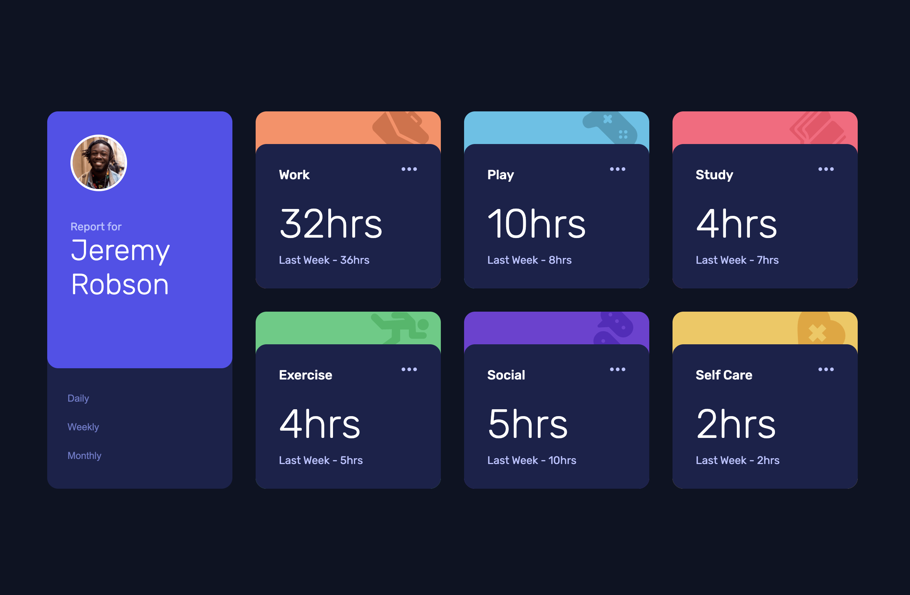

# Frontend Mentor - Time tracking dashboard solution

This is a solution to the [Time tracking dashboard challenge on Frontend Mentor](https://www.frontendmentor.io/challenges/time-tracking-dashboard-UIQ7167Jw).

## Overview

### The challenge

Users should be able to:

- View the optimal layout for the site depending on their device's screen size
- See hover states for all interactive elements on the page
- Switch between viewing Daily, Weekly, and Monthly stats

### Screenshot



### Links

- Live Site URL: [Add live site URL here](https://your-live-site-url.com)

## My process

### Built with

- Semantic HTML5 markup
- CSS custom properties
- Flexbox
- CSS Grid
- Mobile-first workflow
- [React](https://reactjs.org/) - JS library

### What I learned

### 1. State Management with `useState`

I used `useState` in `App.jsx` to manage the selected timeframe. The state is lifted to the parent component and passed down to child components as props.

```jsx
// App.jsx
import { useState } from "react";
import TrackingDash from "./components/trackingDash";

function App() {
  const [timeframe, setTimeFrame] = useState("weekly");

  return (
    <main className="main-page">
      <TrackingDash timeframe={timeframe} setTimeFrame={setTimeFrame} />
    </main>
  );
}

export default App;
```

**Key Takeaways:**

- `useState` returns a state variable and a setter function
- Lifting state to the parent allows multiple children to share and update the same state
- Default value is set to `"weekly"`

---

### 2. Dynamic Rendering with a Render Function

In `TrackingDash`, I created a `renderCards` function that maps through the JSON data and dynamically renders `Card` components based on the current timeframe.

```jsx
// TrackingDash.jsx
import data from "../data/data.json";
import Card from "./card";

const TrackingDash = ({ timeframe, setTimeFrame }) => {
  const renderCards = () => {
    return data.map((item) => {
      // Destructure current and previous values based on selected timeframe
      const { current, previous } = item.timeframes[timeframe];

      return (
        <Card
          key={item.title}
          title={item.title}
          timeframe={timeframe}
          current={current}
          previous={previous}
        />
      );
    });
  };

  return (
    <div className="container">
      {/* Menu with timeframe buttons */}
      <div className="menu-container">
        <div className="buttons">
          <button onClick={() => setTimeFrame("daily")}>Daily</button>
          <button onClick={() => setTimeFrame("weekly")}>Weekly</button>
          <button onClick={() => setTimeFrame("monthly")}>Monthly</button>
        </div>
      </div>

      {/* Card grid - dynamically rendered */}
      <div className="card-grid">{renderCards()}</div>
    </div>
  );
};

export default TrackingDash;
```

**Key Takeaways:**

- Use `.map()` to iterate over JSON data and return JSX elements
- Destructuring `item.timeframes[timeframe]` allows dynamic access based on state
- Always provide a unique `key` prop when rendering lists

---

### 3. Card Component with Dynamic Props

The `Card` component receives props and displays the appropriate data. It also dynamically changes the "previous" label based on the timeframe.

```jsx
// Card.jsx
const Card = ({ title, timeframe, current, previous }) => {
  const previousInfo = (timeframe) => {
    if (timeframe === "monthly") return "Last Month";
    if (timeframe === "weekly") return "Last Week";
    if (timeframe === "daily") return "Yesterday";
  };

  return (
    <div className={`card-container ${title.toLowerCase()}`}>
      <div className="card-content">
        <p className="title-text">{title}</p>
        <p className="current-hours">{current}hrs</p>
        <p className="previous-hours">
          {previousInfo(timeframe)} - {previous}hrs
        </p>
      </div>
    </div>
  );
};

export default Card;
```

**Key Takeaways:**

- Props allow data to flow from parent to child components
- Helper functions can format display text based on conditions
- Dynamic class names enable different styling per card

---

### 4. JSON Data Structure

The data is structured to support multiple timeframes for each activity:

```json
[
  {
    "title": "Work",
    "timeframes": {
      "daily": { "current": 5, "previous": 7 },
      "weekly": { "current": 32, "previous": 36 },
      "monthly": { "current": 103, "previous": 128 }
    }
  }
]
```

## Author

- Website - [Click here](https://my-portfolio-frontend-kappa-lemon.vercel.app/)
- Frontend Mentor - [Click here](https://www.frontendmentor.io/profile/JoshLiu111)
